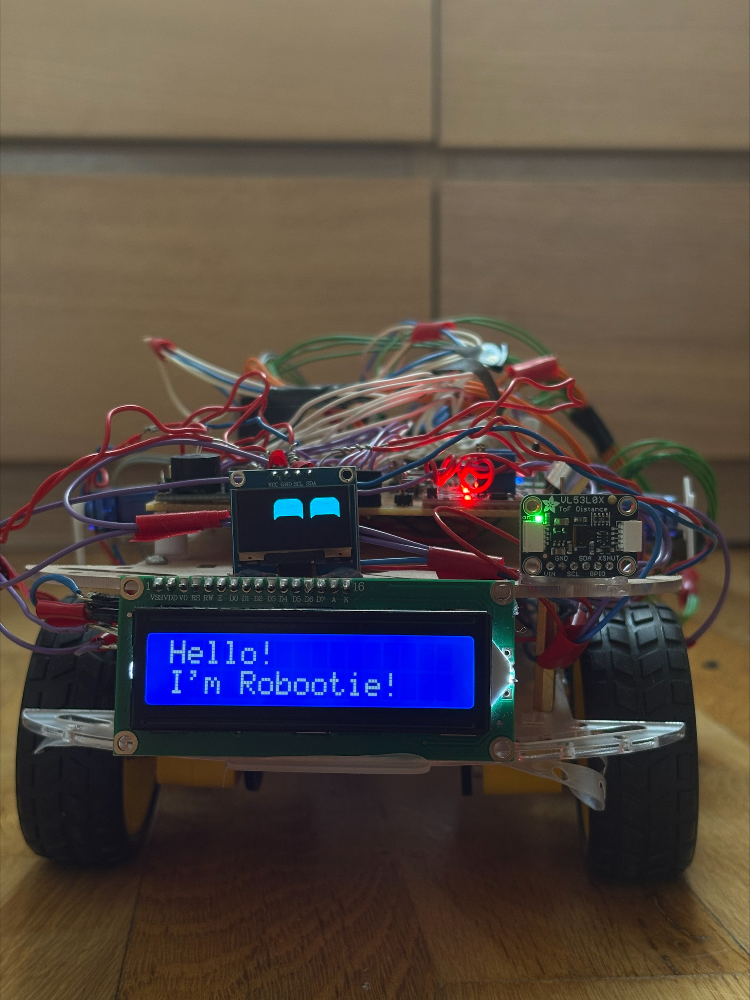
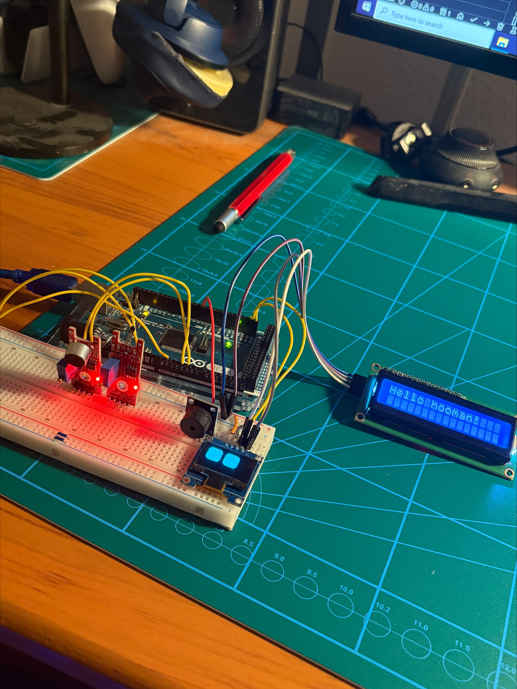
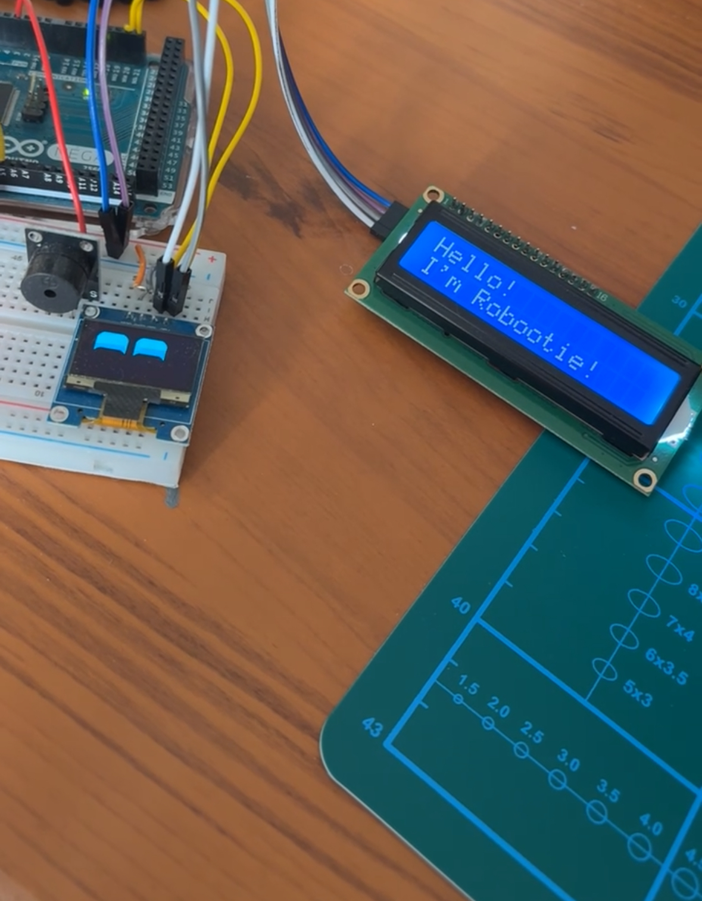
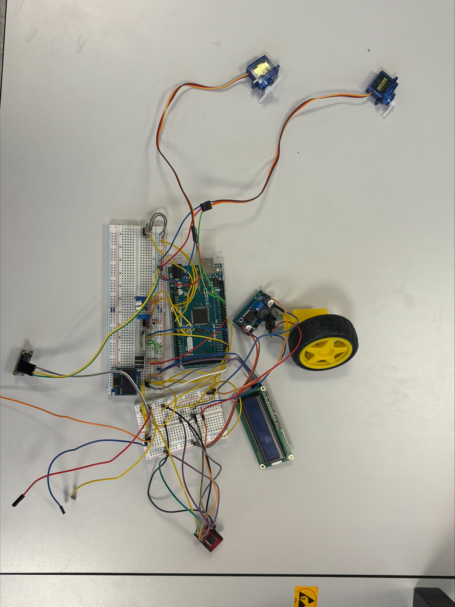
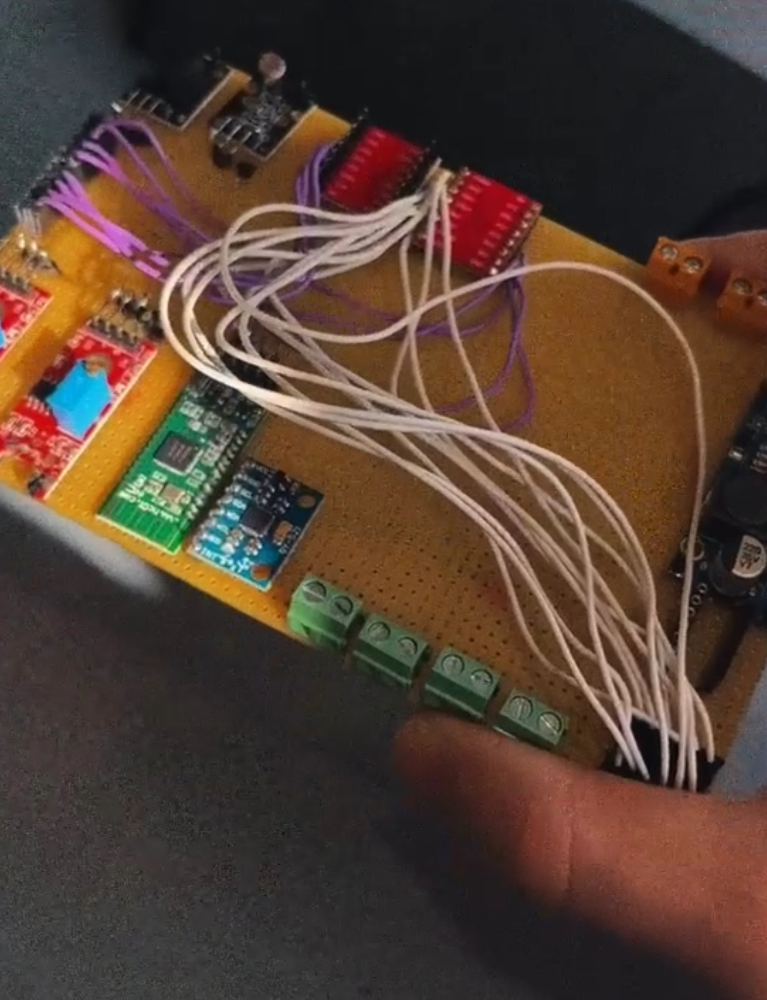
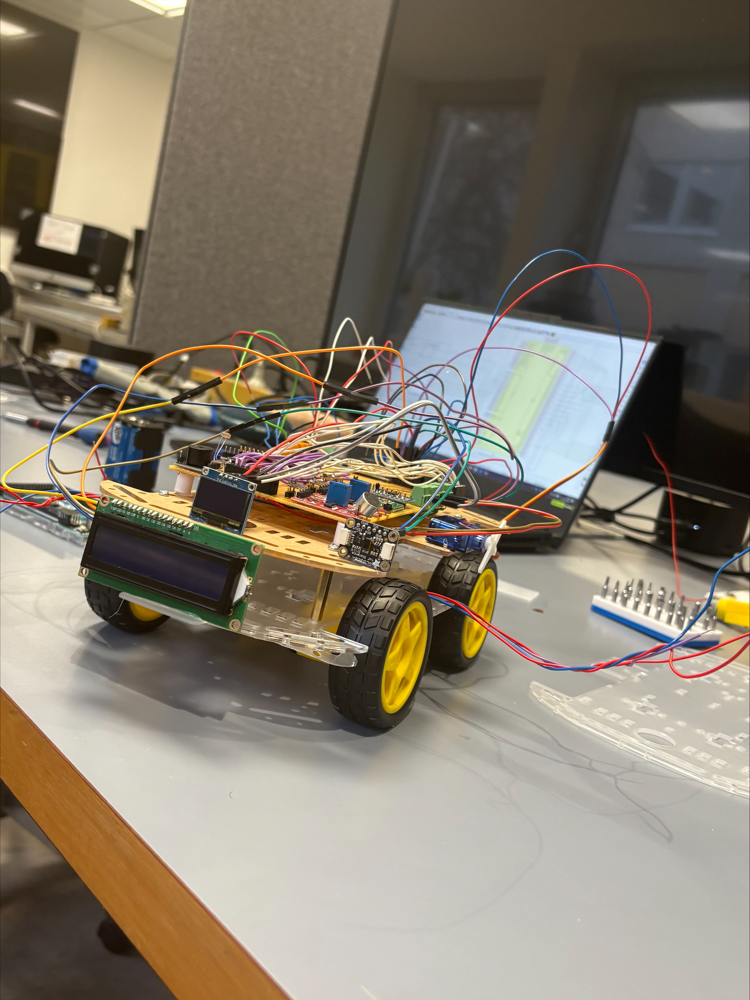
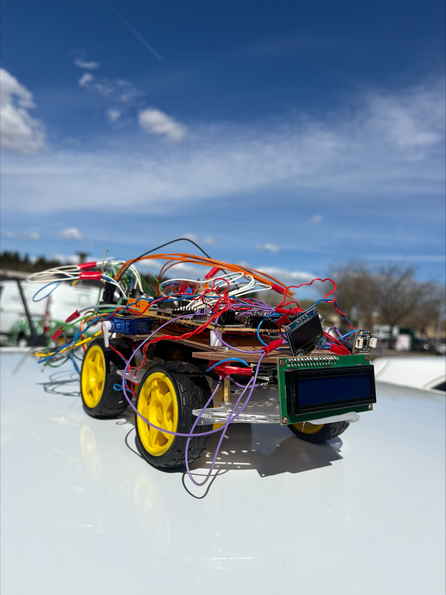
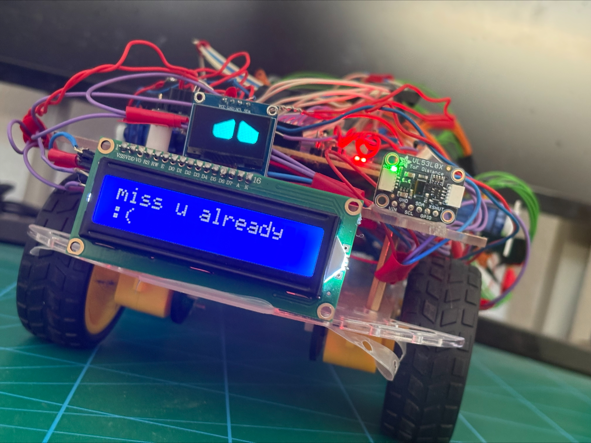
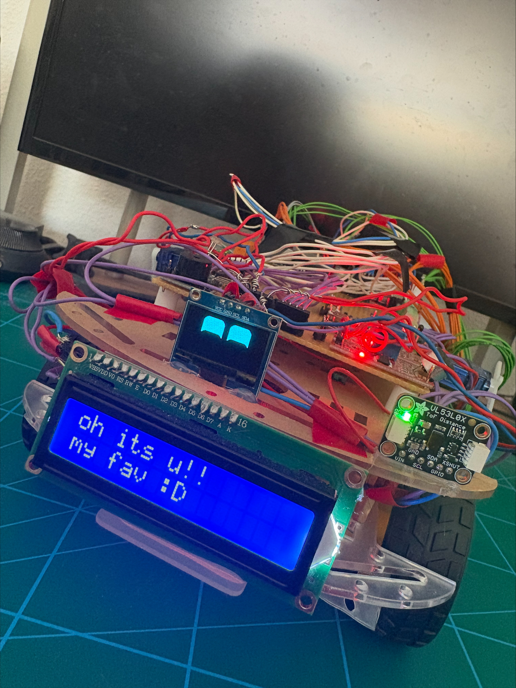

# Robootie

## What is it

<p align="center">
  
</p>

Robootie is a small desktop robot with a face, four wheels, two arms, and a personality that runs entirely off an Arduino Mega 2560. It is not a remote-control toy that just happens to look cute, it is meant to behave like it has moods: it gets bored if nothing happens for a while, it gets startled by sudden noise, it gets visibly sad when you walk away from it, and it can wander around on its own and decide for itself whether something in front of it is a person or just an object.

I built it from scratch over a few months, starting from a breadboard with a single OLED screen and ending up with a fully wired four-wheel chassis with sensors, servos, motors, a buzzer, and Bluetooth control.

### The deeper version

Under the hood, Robootie runs on an event-driven pipeline rather than one giant `loop()` full of if-statements. Roughly:

```
Sensors  →  Events  →  Interpreters  →  Flags
                                          ↓
                                  Behavior FSM
                                          ↓
                              Emotion system (events + flags + time)
                                          ↓
                                System Controller ("the brain")
                                          ↓
                        EyesIntent / ArmsIntent / SoundIntent / DriveIntent
```

- **Sensors** (`src/sensors/`) read raw hardware: a VL53L0X time-of-flight sensor for distance, an MPU6050 for motion (shaken, picked up, flipped), and a microphone module for sound.
- **Interpreters** (`src/interpreters/`) turn raw readings into meaningful flags, like "someone is nearby", "this sounds like music", "it's been quiet for a while".
- A **behavior FSM** (`src/brain/behavior_fsm.cpp`) tracks the big-picture state: asleep, awake, bored, or exploring.
- The **emotion interpreter** combines flags and time into a base mood (happy, sad, angry, tired) plus short-lived transient emotions (startled, laughing).
- The **system controller** (`src/system/system_controller.cpp`) is the actual brain. It is the one file that looks at everything at once and decides what the eyes, mouth, arms, and buzzer should do this tick.
- That decision becomes an **intent struct** for each actuator, which the actuator modules (`src/actuators/`) render: animated eyes on an OLED screen via the FluxGarage RoboEyes library, scrolling phrases on a 16x2 LCD ("the mouth"), servo arm gestures, and buzzer sound patterns.

Driving is handled separately by `src/actuators/drive.cpp`, which controls four DC motors through two TB6612FNG drivers, and `src/system/bluetooth.cpp`, which listens for single-byte commands over a Bluetooth serial module for manual control and for injecting test events without needing to physically trigger sensors.

There is also a self-contained autonomous wandering mode (`src/brain/explore.cpp`) with its own little internal state machine: scan left and right to find the clearest direction, drive that way, back off if something gets too close, occasionally do a silly full spin for no reason, and if it gets close to something, stop and watch whether the distance to it keeps changing over a few seconds, since a static object holds still and a person doesn't.

Here is the full hardware schematic I drew up in KiCad while wiring everything, mostly to keep myself sane:

<p align="center">
  
</p>

**Stack:** Arduino Mega 2560, PlatformIO + Arduino framework, ~5000 lines of C.

## What it can do

- **Reacts to sound.** Talking, music, sudden noise bursts, and general ambient noise each trigger different responses, from dancing arms when music plays to a startled jump-and-scream when something bangs loudly nearby.
- **Notices people.** Using the front-mounted distance sensor, it knows when someone walks up, greets them with a wave and a happy beep, gets visibly uncomfortable if you linger too close for too long, and plays a sad "goodbye" animation when you walk away.
- **Knows when it's being handled.** The accelerometer/gyro lets it tell the difference between being shaken (panic), picked up (excited), put down (briefly sad), and flipped upside down (genuinely upset).
- **Wanders off on its own.** After a couple of minutes of nothing happening, it might fall asleep, sulk in a "bored" idle loop, or go into autonomous explore mode, scanning for open space, driving around, avoiding obstacles, and occasionally doing a celebratory spin.
- **Tells people apart from things** during exploration, by holding its distance reading steady for a few seconds and checking whether it changes. People move, furniture doesn't.
- **Wakes up grumpy.** If you make noise while it's asleep, there is a real chance it wakes up angry rather than happy about it, exactly like an actual housemate.
- **Can be driven manually** over Bluetooth, with commands for direction, speed, braking, individual motor testing, and forcing test events for debugging without needing to physically recreate sensor conditions.
- **Expresses all of this visually**, not just in logic: animated OLED eyes with different moods and a trembling/squinting/sweating modifier system, a scrolling-phrase LCD mouth, arm gestures (wave, dance, shiver, "go away" flailing), and a buzzer with distinct sound patterns per emotion.

## Struggles and lessons

This thing did not start as a four-wheeled robot. Frankly I didn't even plan to turn it into what it became. It naturally evolved with curiousity. It started as a breadboard with barely anything on it, and grew one module at a time.

<table>
<tr>
<td width="50%">

<p align="center"><em>Stage 1 — the very first version. Just the Mega, a couple of sound sensor modules, the OLED for the eyes, and an LCD wired off to the side just to prove I could get it to say hello.</em></p>
</td>
<td width="50%">

<p align="center"><em>Stage 2 — same idea, a bit further along, and the LCD finally introducing itself by name.</em></p>
</td>
</tr>
<tr>
<td width="50%">

<p align="center"><em>Stage 3 — first time it had wheels. Two DC motors, the buck converter to step the battery voltage down to something the logic side could survive, the first two arm servos, and a proximity sensor.</em></p>
</td>
<td width="50%">

<p align="center"><em>Stage 4 — hand-wiring the perfboard that would become the permanent home for the sensor modules, the Bluetooth module, and the MPU6050, instead of a breadboard that falls apart if you sneeze near it.</em></p>
</td>
</tr>
<tr>
<td width="50%">

<p align="center"><em>Stage 5 — everything mounted on the real four-wheel chassis for the first time. Wires everywhere, debugging next to the schematic on my laptop.</em></p>
</td>
<td width="50%">

<p align="center"><em>Stage 6 — taking it outside for a test once the chassis actually held together. Looked like a bird's nest from above. Still worked.</em></p>
</td>
</tr>
</table>

A few things that genuinely bit me along the way:

- **Floating pins were villanous.** The motor drivers have STBY tied directly to 5V, so the moment power comes on, the driver is live. If the direction pins haven't been set yet, the motors get random noise on those pins and just start moving on their own. `drive_init()` now has to run before basically anything else for that exact reason.
- **Two motor drivers was overkill.** I wired up two TB6612FNG drivers, one per side, treating it like four independently controlled wheels. In reality this is a skid-steer robot: the left wheels always move together and the right wheels always move together. One driver, with each of its two channels driving a left/right pair in parallel, would have done the exact same job. I only really understood this after staring at this annotated photo trying to keep eight direction pins and four PWM pins straight in my head:

  <p align="center">
    
  </p>

- **SRAM is limited.** All the LCD phrase arrays were originally living in regular RAM, which on a Mega adds up fast. At one point the build was sitting at 71.7% SRAM usage just from string literals. Moving everything into `PROGMEM` dropped that to 17%.
- **Sensor hardware faults are a thing.** The light sensor and temperature sensor both ended up with unreliable, floating-pin readings on the actual hardware, so they're disabled in `main.cpp` rather than feeding garbage into the emotion system. Lesson learned the hard way: breadboard jumpers are not a long-term wiring strategy.
- **Bad math hides in plain sight.** The temperature comfort logic had a stray `* -1.83` multiplier that inverted every reading, so "hot" and "cold" responses were effectively backwards for a while before I caught it.
- **Planning the wiring on paper (or on a photo) actually helps.** Before populating the perfboard for real, I annotated a preview shot of it with every signal name so I would not lose track of which pin was which once it was all soldered in:

  <p align="center">
    
  </p>

And because the personality system is the actual point of this project, here is what it looks like reacting to me, not just specs on paper:

<table>
<tr>
<td width="50%">

<p align="center"><em>Sulking after I walk away.</em></p>
</td>
<td width="50%">

<p align="center"><em>And lighting up the moment I come back. So cute!</em></p>
</td>
</tr>
</table>

## Demo

<video src="PHOTOS/video-demo.mp4" controls width="600"></video>

## How it could've been improved

- **A different microcontroller.** The Mega 2560 has plenty of pins, simple to use and coincidentally was the first microcontroller we were learning to use in our 2nd semester course "Datateknik og programmering", but it has no built-in Bluetooth or Wi-Fi, so I'm stuck routing everything through an external Bluetooth serial module. An ESP32 would give built-in wireless, way more processing headroom, and would let me drop a whole module and its wiring.
- **3D printed parts.** Right now the chassis is a mix of cut plywood, acrylic, and whatever I could improvise to mount servos and sensors at the right angle. Custom-fitted 3D printed brackets and a proper chassis would replace a lot of tape and guesswork with something that actually fits.
- **A real PCB.** The perfboard was a big step up from loose breadboards, but it's still hand-soldered point-to-point wiring, which is exactly the kind of thing that turns into a tangle the moment you add one more module. The KiCad schematic above was partly drawn as a first step toward an actual PCB design, which would cut down the wiring mess enormously and remove a bunch of failure points.
- **One motor driver instead of two.** As mentioned above, this was a straightforward design mistake. A single TB6612FNG handling left/right pairs would have simplified the wiring, freed up several Mega pins, and made the whole drivetrain section of the schematic about half the size.
- **Cleaner power separation.** The light and temperature sensors had to be disabled entirely because of unreliable, floating-pin behavior. Better grounding and proper pull resistors from the start would have saved two sensors that are currently just dead weight in the `include` list.
- **Less wire, more connector.** Almost every evolution photo above has the same problem: a visible bird's nest of jumper wires. Ribbon cables, proper headers, or just the PCB mentioned above would go a long way toward making this look (and behave) less like a science fair project.

## Conclusion

Robootie started as "can I make an OLED screen blink two eyes" and turned into a four-wheeled robot with an event-driven personality engine, autonomous exploration, motion and proximity awareness, and a soft spot for greeting people. It's the most complete hardware-plus-firmware project I've built solo, and it forced me through every part of the stack: schematic design, soldering, power regulation, sensor calibration, and a real C architecture instead of one big sketch file.

It's not finished. The explore mode is the newest piece and still rough around the edges, and the hardware has plenty of room to grow into something sturdier. But it works, it has a face, and it gets genuinely sad when I leave the room, which is honestly more than I expected to pull off when I started.
